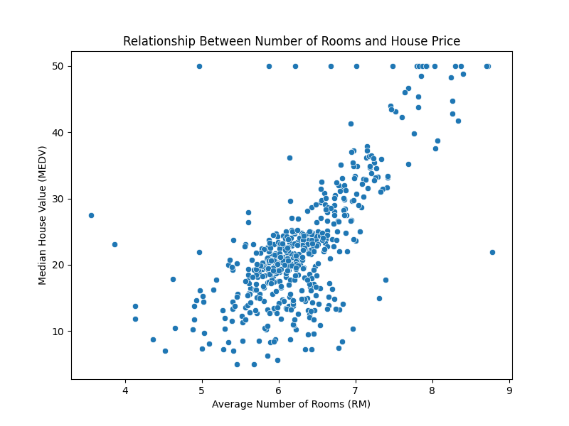
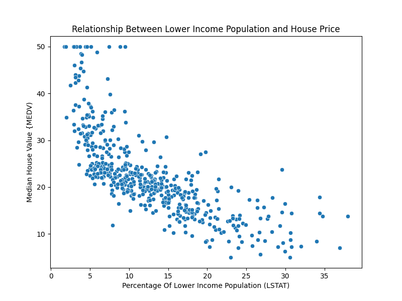
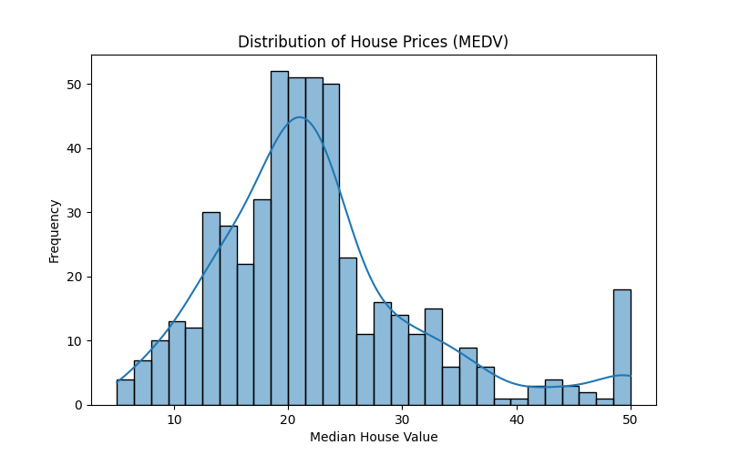

# Codveda Data Science Internship

This repository contains projects completed during my **Data Science Internship at Codveda Technologies**.

## Projects

### 1️⃣ Web Scraping Project
- Scraped quotes and author information from a website using Python.
- Implemented pagination scraping to collect data from multiple pages.
- Used `requests` and `BeautifulSoup` for web scraping.
- Organized the data into a structured dataset using `pandas`.

Output dataset:
quotes_dataset.csv

### 2️⃣ House Price Data Analysis
- Performed exploratory data analysis on a housing dataset.
- Analyzed feature relationships with house prices.
- Used visualization tools such as `matplotlib` and `seaborn`.

### Example Visualizations

Key techniques used:
Data Cleaning,
EDA,
Correlation Analysis,
Outlier Detection

## Tools & Libraries

Python  
Pandas  
NumPy  
Matplotlib  
Seaborn  
BeautifulSoup  
Requests  

---

## Internship

Data Science Internship  
Codveda Technologies
